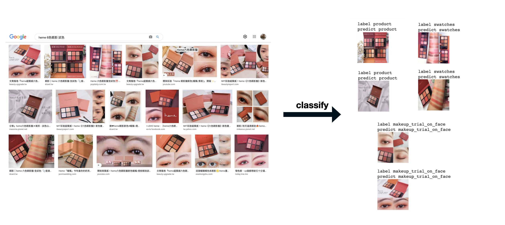
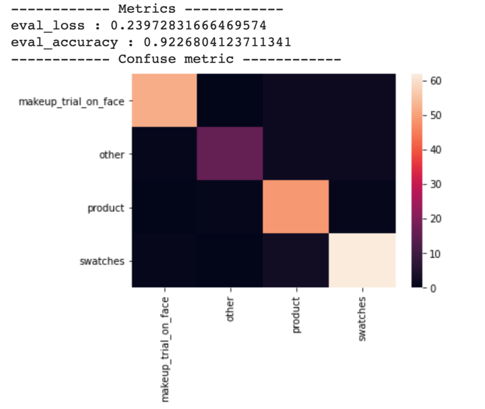

# MakeUP
自動當我們搜尋某個美妝產品時，幫我們把文章中的試色文章找出來




TODO :
- [x] Download Model
- [ ] Simple Inference Function
- [ ] Incremental learning
- [ ] Inference Server

## 使用方式
安裝 package :
```
git clone https://github.com/Lisa06010416/MakeUP.git
cd MakeUP.git
pip install .
```


## Project 功能與遇到的問題
#### 環境檢查/安裝：
```
from src.lisa.utils import envchecker

# 在colab上的話自動安裝
if envchecker.is_in_colab():
  envchecker.set_install_when_check_par = True

envchecker.has_efficientnet()
envchecker.has_mlflow()
envchecker.has_pyngrok()
envchecker.has_transformers()
envchecker.set_mlflow_ui()

"""
[I 20210315 12:50:48 envchecker:30] Runing on colab
[I 20210315 12:50:48 envchecker:31] Set install_when_check = True
[I 20210315 12:50:54 envchecker:51] Success install efficientnet_pytorch
[I 20210315 12:51:06 envchecker:51] Success install mlflow
[I 20210315 12:51:11 envchecker:51] Success install pyngrok
[I 20210315 12:51:18 envchecker:51] Success install transformers==4.1.0
[I 20210315 12:51:18 envchecker:46] Have mlflow
[I 20210315 12:51:23 envchecker:87] MLflow Tracking UI: https://b05fc7754db5.ngrok.io
"""
```


#### 爬資料：
爬蟲環境設置：
* 自動下載對應版本的chromedriver(但寫完後發現可以用 webdriver-manager XDD)
```
from makeup.utils.envchecker import get_chrome_driver
get_chrome_driver()
```
* 在設定 headless的情況下爬蟲會被小紅書擋,因此參考 [這篇教學](https://intoli.com/blog/making-chrome-headless-undetectable/) 對我們的發出的request做修改，用下面的方法打開mitmdump server :

```
run mitmdump  :
from makeup.script import setup_mitmdump_server
setup_mitmdump_server()

close mitmdump  :
from makeup.script import close_mitmdump_server
close_mitmdump_server()
```

爬蟲功能 (tests/scraper_test.py) :
* 可以爬三個來源的資料 ： ptt(PttScraper)、dcard(DcardScraper)、小紅書(XiaohongshuScraper)
* 可以換要用來爬蟲的base : request、Selenium，但要爬小紅書的資料的話一定要用 Selenium + 開啟 mitmdump server
* 下載資料名字不要重複


#### 訓練模型：
* makeup_switch_efficientnet.ipynb
* 使用EfficientNet作為圖片分類模型
* 因為想要直接用transformers的trainer，因此對EfficientNet做了部分修改(in tests/efficientnnt_test.py) :
```
from transformers import Trainer
from makeup.model.efficientnet import EfficientNetModify
trainer = Trainer(
            model= your EfficientNetModify model,
            ...)
```

* 訓練結果
    * 由ptt爬約800裝訓練資料，Dcard爬約180張驗證資料，分四種類別：
        * makeup_trial_on_face 
        * product 
        * swatches
        * other
    